# Documentación Fase 2 - Grupo 19

## Integrantes

| Nombre Completo | Carnet |
|-----------------|--------|
| Daniel Andreé Hernandez Flores | 202300512 |
| Matthew Emmanuel Reyes Melgar | 202202233 |
| Dilan Conaher Suy Miranda | 201801194 |

## Full Backup

### Día 1 - 23/03/2026

Como bien se describe en el enunciado, lo primero que hicimos fue alterar el script de la creación de la base de datos, esto con el fin de agregar las tablas de log y las triggers correspondientes para cada tabla.

Tenemos esta estructura de tablas de log:

**TABLAS DE LOG (Registro / Bitacora)**
- Cada tabla LOG almacena:
  - log_id:         Identificador unico autogenerado
  - log_operacion:  Tipo de operacion (INSERT, UPDATE, DELETE)
  - log_fecha:      Fecha y hora de la operacion
  - log_usuario:    Usuario que realizo la operacion
  - Todas las columnas de la tabla original (sin constraints)

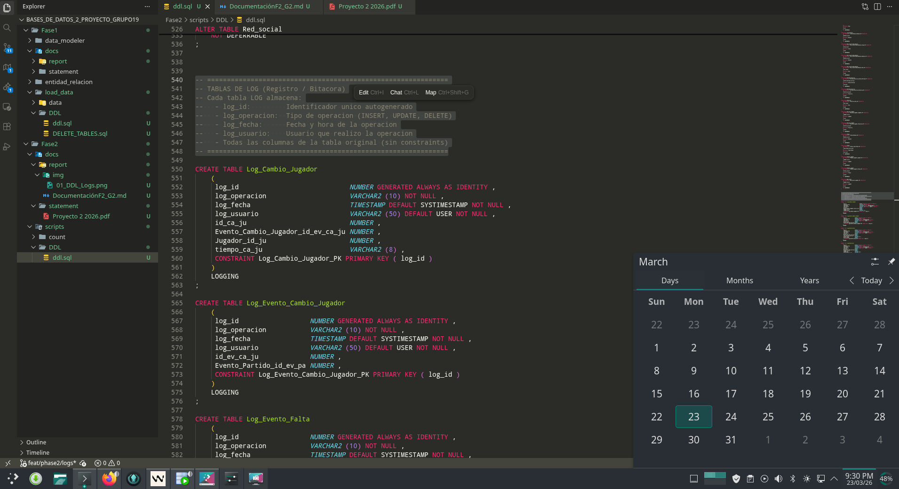

>**NOTA:** Se creó otro usuario con los privilegios necesarios para poder realizar las pruebas de las triggers y además para que pudiera acceder a la configuración de Backups, ya que Oracle maneja la seguridad de los usuarios de manera diferente, por lo tanto es un nuevo esquema.

```sql
-- USER SQL
-- Creamos el usuario (cambia 'usuario_juego' y el password por los que prefieras)
CREATE USER BD2_P1_F2 IDENTIFIED BY "12345";

-- QUOTAS
-- Le damos espacio de almacenamiento ilimitado en el disco por defecto para que guarde sus tablas
ALTER USER BD2_P1_F2 QUOTA UNLIMITED ON USERS;

-- ROLES
-- CONNECT: Para iniciar sesión. RESOURCE: Para crear objetos básicos de desarrollo.
GRANT CONNECT, RESOURCE TO BD2_P1_F2;

-- SYSTEM PRIVILEGES
-- Permisos explícitos de desarrollo
GRANT CREATE SESSION TO BD2_P1_F2;
GRANT CREATE TABLE TO BD2_P1_F2;
GRANT CREATE TRIGGER TO BD2_P1_F2;
GRANT CREATE VIEW TO BD2_P1_F2;
GRANT CREATE SEQUENCE TO BD2_P1_F2;

-- EL PERMISO PARA HACER BACKUPS (RMAN)
GRANT SYSDBA TO BD2_P1_F2;
```

Luego de eso se ejecutaron los scripts de creación de tablas y triggers, y se realizaron las pruebas de las triggers para verificar que funcionaban correctamente. También se hizo la carga de la data desde los inserts generados en la fase 1.

Se procedió con la ejecución de un Backup solo para familiarizarnos con el proceso de backup y restore en Oracle Database 21c.

Crear el Script sqldev.rman

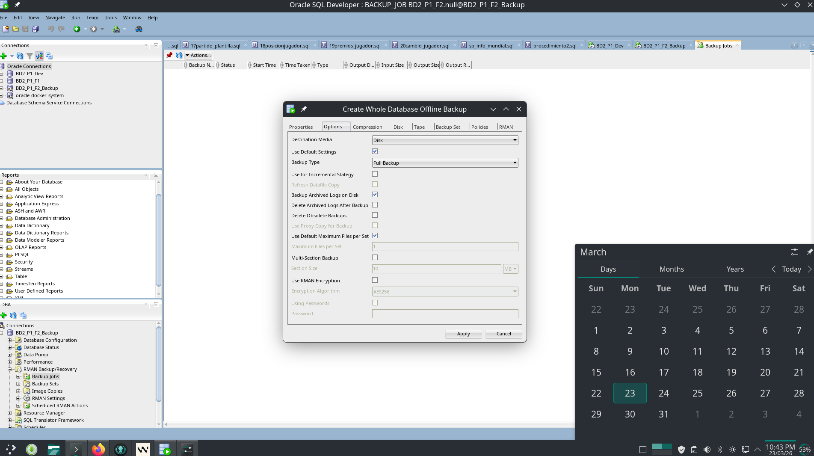

Este paso depende, pero se ejecuta dentro de la máquina local o en algunos casos, dentro de docker

Pero lo importante es ejecutar el script sqldev.rman

```bash
rman target / @/tmp/sqldev.rman
```

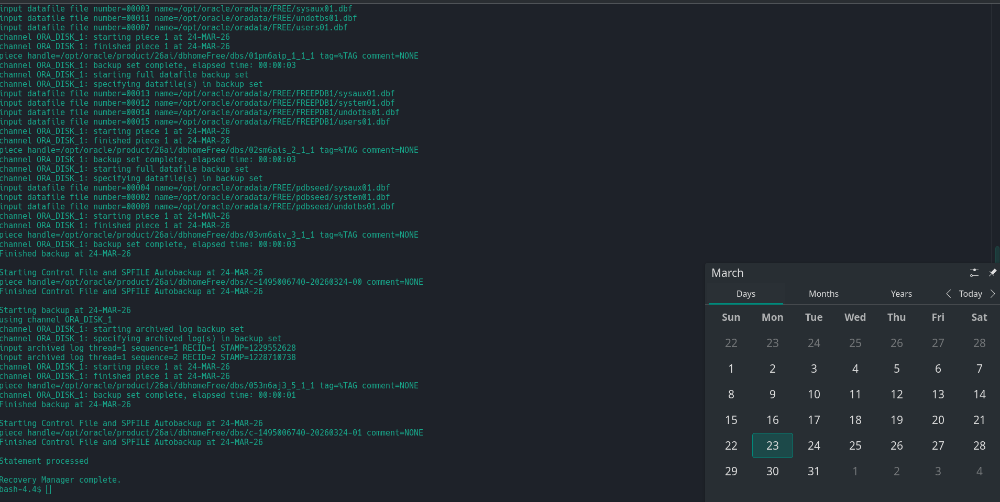

El proceso fue bastante rápido, durando aproximadamente 1 minuto.

Y pudimos verificar que el backup se creó correctamente.


```sql
SELECT 
    piece#, 
    handle AS ruta_del_archivo, 
    completion_time AS fecha_finalizacion, 
    status
FROM 
    v$backup_piece 
ORDER BY 
    completion_time DESC;
```

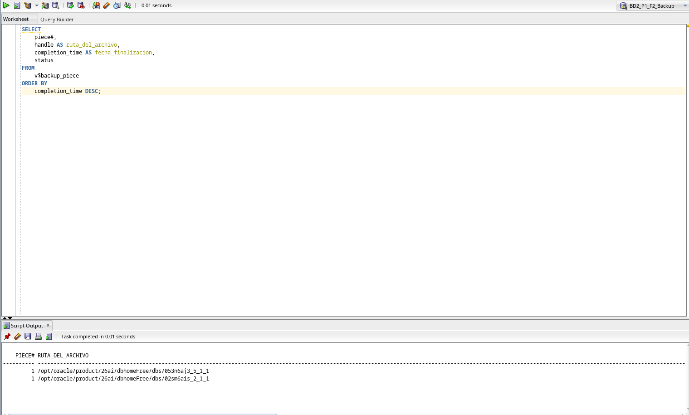

### Día 2 - 24/03/2026

Se crearon datos simulados para verificar el funcionamiento de las triggers y backups.

Primero vamos a demostrar la cantidad de datos que originalmente teníamos en las tablas:

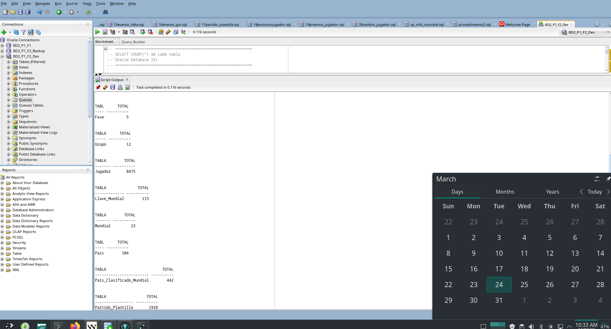

Ahora vamos a insertar datos simulados para verificar el funcionamiento de las triggers y el cambio en la base de datos.

Luego de la carga ejecutamos nuevamente el script de verificación de cantidad de datos:

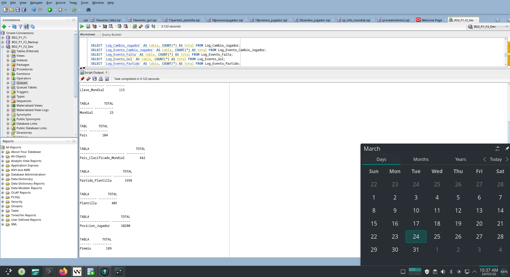

Como podemos notar se aumentaron 15 partidos con varias de sus tablas simuladas en este caso para el Mundial 2026.

Por lo que vamos a proceder a realizar el segundo backup para verificar que el proceso de backup y restore funciona correctamente.


### Día - 3 25/03/2026

Se crearon otros 15 partidos con sus respectivas tablas simuladas para verificar el funcionamiento de las triggers y el cambio en la base de datos.

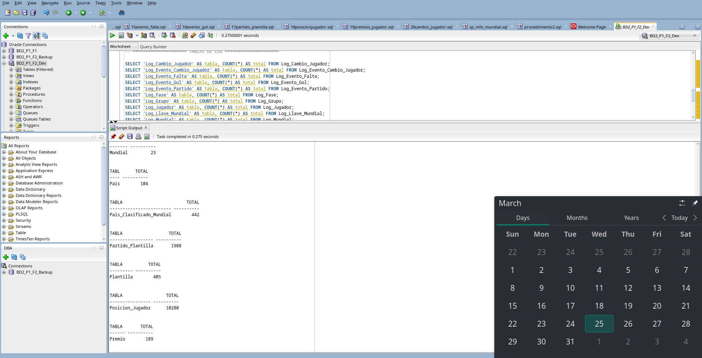

También se realizó su proceso de Full Backup para verificar que el proceso de backup y restore funciona correctamente.

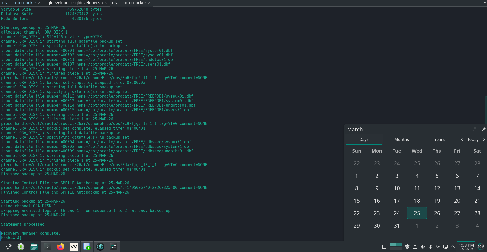

### Día - 4 26/03/2026

Se realizó el cambio a UPPER CASE en los nombres de los países para verificar el funcionamiento de las triggers y el cambio en la base de datos.

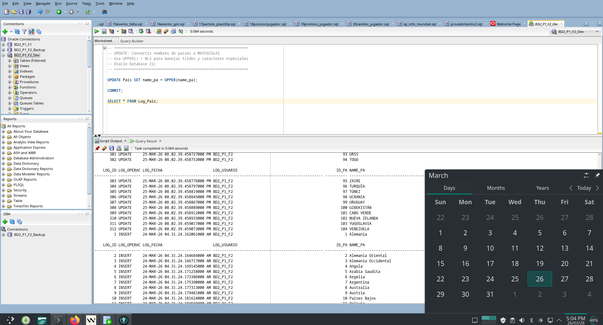

También se realizó su proceso de Full Backup para verificar que el proceso de backup y restore funciona correctamente.

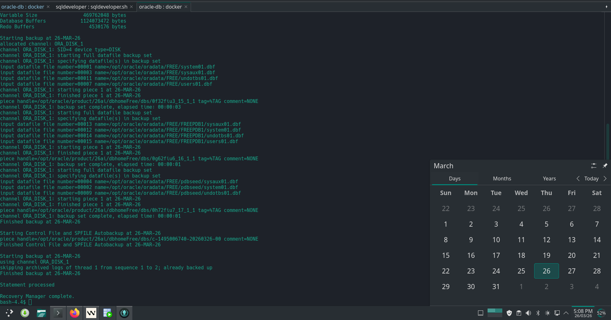


## Incremental Backup

### Configuración Previa

Antes de iniciar el proceso de backup incremental, se verificó que la base de datos 
estuviera en modo ARCHIVELOG (requisito para RMAN) y se configuró el área de recuperación:

```sql
SELECT LOG_MODE FROM V$DATABASE;
-- Resultado: ARCHIVELOG ✅

ALTER SYSTEM SET DB_RECOVERY_FILE_DEST_SIZE = 10G SCOPE=BOTH;
ALTER SYSTEM SET DB_RECOVERY_FILE_DEST = '/opt/oracle/recovery_area' SCOPE=BOTH;
```

También fue necesario abrir el PDB correctamente y guardar su estado para que 
persista entre reinicios:

```sql
ALTER PLUGGABLE DATABASE freePDB1 OPEN;
ALTER PLUGGABLE DATABASE freePDB1 SAVE STATE;
```

### Día 0 - 23/03/2026 (LEVEL 0 - Backup Base)

Se realizó la carga completa de la data base (Fase 1) con COMMIT confirmado, 
y se tomó el backup incremental LEVEL 0, que sirve como fotografía base para 
los incrementales posteriores.

Script ejecutado (`backup_incr_level0.rman`):

```bash
SHUTDOWN IMMEDIATE;
STARTUP MOUNT;
BACKUP INCREMENTAL LEVEL 0 DEVICE TYPE DISK TAG 'INCR_L0_BASE' DATABASE;
BACKUP DEVICE TYPE DISK TAG 'ARCH_L0_BASE' ARCHIVELOG ALL NOT BACKED UP;
ALTER DATABASE OPEN;
ALTER PLUGGABLE DATABASE ALL OPEN;
```

```bash
rman target / @/opt/oracle/backup_incr_level0.rman
```

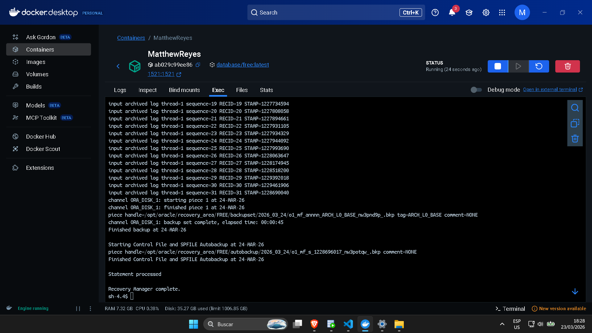

Verificación del backup y estado inicial de la base de datos:

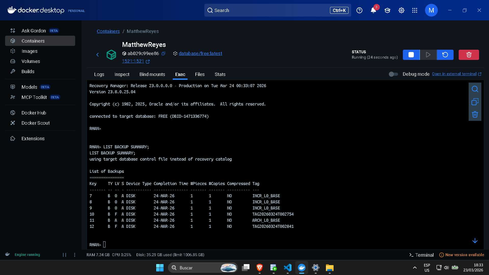

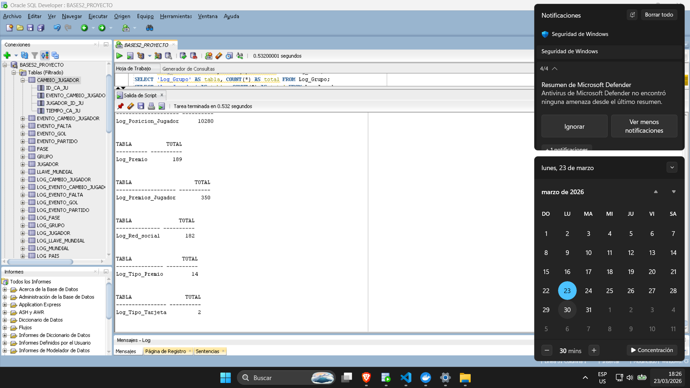

### Día 1 - 25/03/2026 (LEVEL 1 - Dieciseisavos)

Se cargaron 15 partidos de dieciseisavos de final con sus respectivos goles, 
faltas y cambios de jugador (IDs Evento_Partido 965–979).

Script ejecutado (`backup_incr_dia1.rman`):

```bash
SHUTDOWN IMMEDIATE;
STARTUP MOUNT;
BACKUP INCREMENTAL LEVEL 1 DEVICE TYPE DISK TAG 'INCR_L1_DIA1' DATABASE;
BACKUP DEVICE TYPE DISK TAG 'ARCH_L1_DIA1' ARCHIVELOG ALL NOT BACKED UP;
ALTER DATABASE OPEN;
ALTER PLUGGABLE DATABASE ALL OPEN;
```

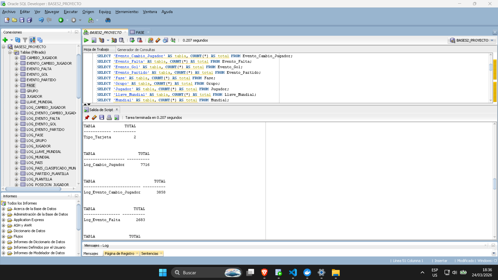

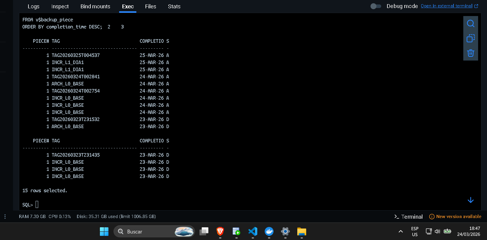

### Día 2 - 28/03/2026 (LEVEL 1 - Eliminatorias)

Se cargaron 15 partidos adicionales correspondientes a Octavos, Cuartos, 
Semifinales y Final (IDs Evento_Partido 980–994).

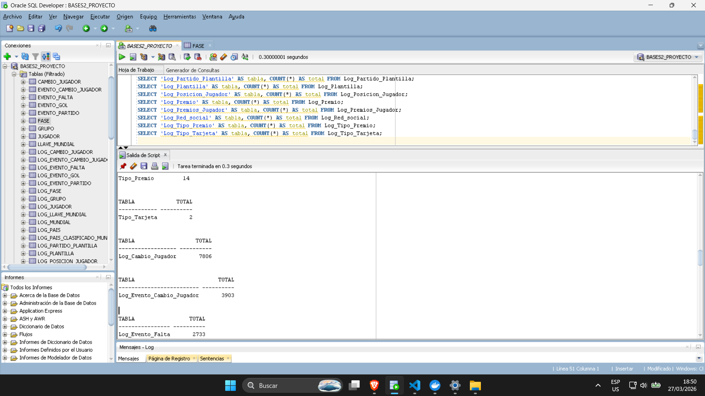

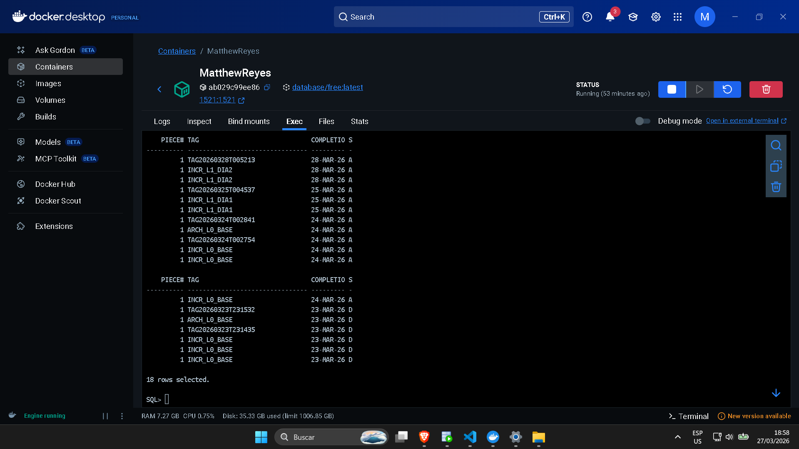

### Día 3 - 30/03/2026 (LEVEL 1 - UPDATE Países)

Este día no hubo inserts, sino un UPDATE masivo que convirtió todos los 
nombres de países a MAYÚSCULAS para verificar que los backups incrementales 
capturan cambios de tipo UPDATE correctamente.

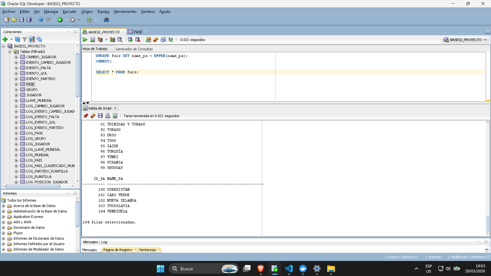

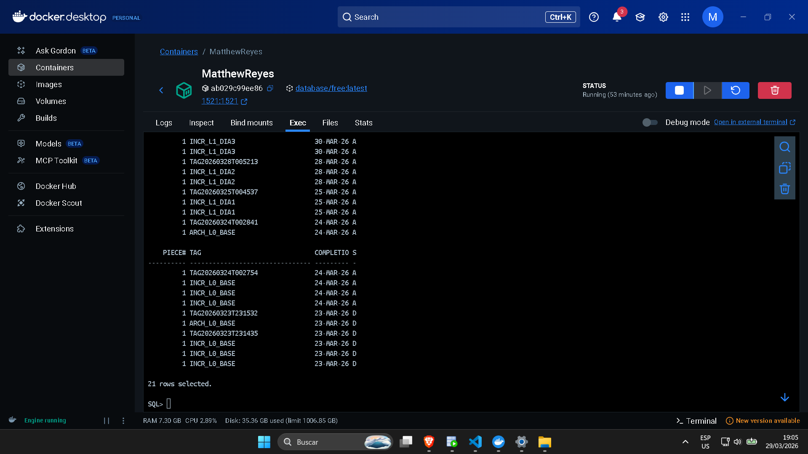

### Restauración Incremental

Para simular un desastre, se ejecutó DROP TABLE en cascada sobre todas las 
tablas del esquema BASES2_PROYECTO. Luego se procedió con la restauración 
usando point-in-time recovery para recuperar el estado exacto del Día 3, 
excluyendo los DROP TABLE posteriores.

Script de restauración (`restore_incremental.rman`):

```bash
SHUTDOWN IMMEDIATE;
STARTUP MOUNT;
RESTORE DATABASE UNTIL TIME 
  "TO_DATE('2026-03-31 23:59:59','YYYY-MM-DD HH24:MI:SS')";
RECOVER DATABASE UNTIL TIME 
  "TO_DATE('2026-03-31 23:59:59','YYYY-MM-DD HH24:MI:SS')";
ALTER DATABASE OPEN RESETLOGS;
ALTER PLUGGABLE DATABASE ALL OPEN;
```

RMAN aplicó automáticamente los backups en orden secuencial:
1. INCR_L0_BASE (base)
2. INCR_L1_DIA1
3. INCR_L1_DIA2
4. INCR_L1_DIA3

**Tiempo de restauración: ~6 segundos**

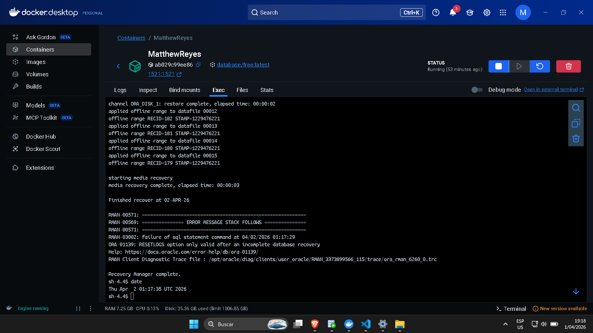

Verificación post-restauración — datos recuperados con países en MAYÚSCULAS:

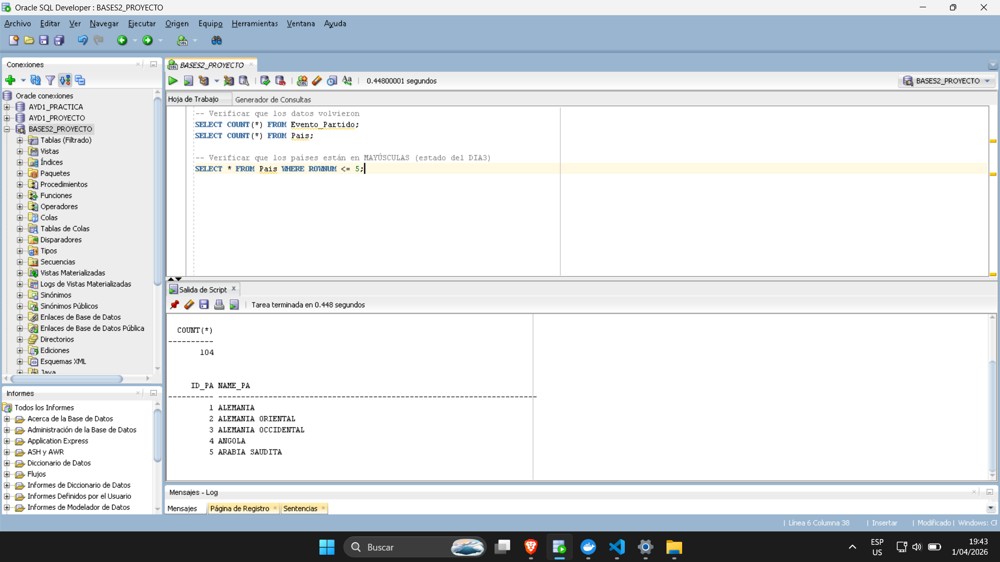